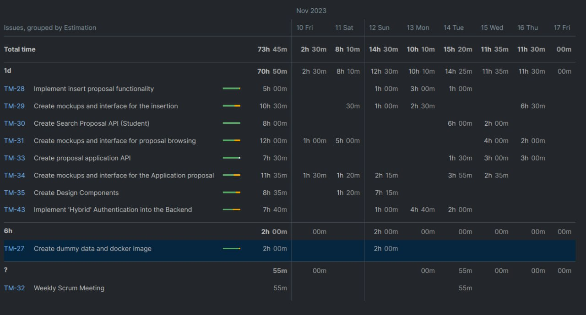

TEMPLATE FOR RETROSPECTIVE (Team 12)
=====================================

The 

should include _at least_ the following
sections:

- [process measures](#process-measures)
- [quality measures](#quality-measures)
- [general assessment](#assessment)

## PROCESS MEASURES 

### Macro statistics

- Number of stories committed vs. done 
2 out of 3
- Total points committed vs. done 
6 out of 14

- Nr of hours planned vs. spent (as a team)
 70hours out of 114hours 

**Remember**a story is done ONLY if it fits the Definition of Done:
 
- Unit Tests passing 

- Code review completed

- Code present on VCS

- End-to-End tests performed

> Please refine your DoD if required (you cannot remove items!) 

### Detailed statistics

| Story  | # Tasks | Points | Hours est. | Hours actual                |
|--------|---------|--------|------------|-----------------------------|
| #1     |    3    |    3   |   3 days   |   4 days 2 hours            |
| #3     |    2    |    3   |   2 days   |   2 days 4 hours 20minutes  |

#### Time Report (Youtrack)

   

> place technical tasks corresponding to story `#0` and leave out story points (not applicable in this case)

- Hours per task average, standard deviation (estimate and actual)
- Total task estimation error ratio: sum of total hours estimation / sum of total hours spent - 1

  
## QUALITY MEASURES 

- Unit Testing:
  - Total hours estimated
  - Total hours spent
  - Nr of automated unit test cases 
  - Coverage (if available)
- E2E testing:
  - Total hours estimated
  - Total hours spent
- Code review 
  - Total hours estimated 
  - Total hours spent
  

## ASSESSMENT

- What caused your errors in estimation (if any)?
1- some tasks demand more time so we lost most of out time implementing on the Authentication part?
2- Too many people on the same type of job created confusion instead of improving the workflow

- What lessons did you learn (both positive and negative) in this sprint?

Positive:
We tried to split work more vertically and manage to work vertical way
We manage to have some tests!
Negative:
The new work split division wasn’t working well at all, and we wren’t able to finish all the story that we committed at first

- Which improvement goals set in the previous retrospective were you able to achieve? 
- To split the work in multiple parallel flows so that we can start to work at the same time 
- Which ones you were not able to achieve? Why?
	- We haven’t achieved a general project view to each member
- Improvement goals for the next sprint and how to achieve them (technical tasks, team coordination, etc.)
1 - Planning a middle week test demo to see how the project is going  
	2 - Assign less people on too generic task 
3 - Assign a review all project code on all member 	

- One thing you are proud of as a Team!!
	- The team have a good availability to meet on weekly scrum meetings to fix questions and code
  - The collaboration was great on pair programming

