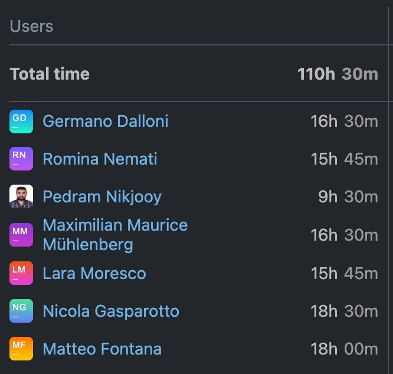
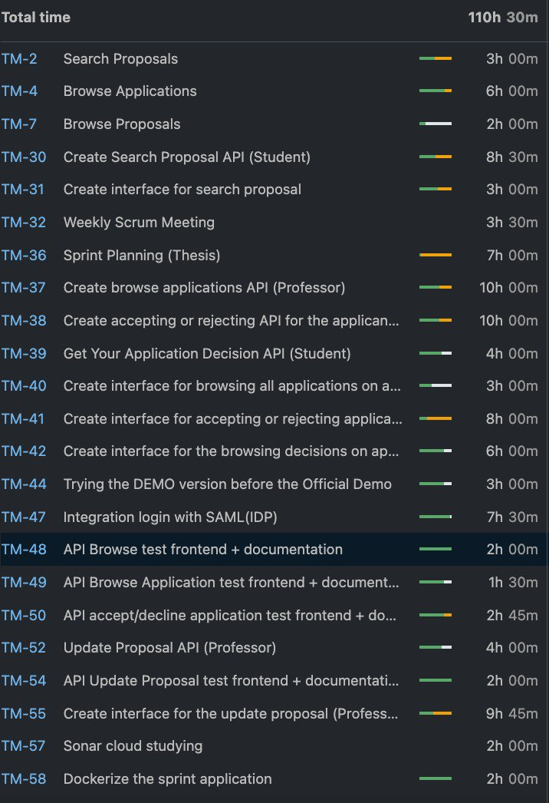

RETROSPECTIVE (Team 12)
=====================================

The 

should include _at least_ the following
sections:

- [process measures](#process-measures)
- [quality measures](#quality-measures)
- [general assessment](#assessment)

## PROCESS MEASURES 

### Macro statistics

- Number of stories committed vs. done 
5 out of 6
- Total points committed vs. done 
17 out of 25

- Nr of hours planned vs. spent (as a team)
 110 hours 30 minutes  out of 112 hours 

**Remember**a story is done ONLY if it fits the Definition of Done:
 
- Unit Tests passing 

- Code review completed

- Code present on VCS

- End-to-End tests performed

> Please refine your DoD if required (you cannot remove items!) 

### Detailed statistics
| Story  | # Tasks | Points | Hours est. | Hours actual |
|--------|---------|--------|------------|--------------|
| #0   |     6    |  -    |     2 days 2 hours         |    5 days 1 hour 45 minutes      |
| #4   |  3        |  3    |     2 days                    |   2 days 5 hours            |
| #5    | 3        |  3   |   1 day  2 hours         |      2 days 4 hours 45 minutes        |
|#6     | 3        | 3        |   1 day 4 hours        |        1 day 30 minutes
|#7     | 3        | 3        | 1 day 4 hours       |    2 hours
|#8     |3         | 5        | 1 day 4 hours       |  1 day 7 hours 45 minutes

   

> place technical tasks corresponding to story `#0` and leave out story points (not applicable in this case)

- Hours per task average, standard deviation (estimate and actual)
- Total task estimation error ratio: sum of total hours estimation / sum of total hours spent - 1
        80/ 109.75 - 1 = -0.99

  
## QUALITY MEASURES 

- Unit Testing:
  - 4 hours
  - 5 hours
  - Nr of automated unit test cases 
  - 20%
- E2E testing:
  - 2 hours
  - 1 hour
- Code review 
  - 3 hours
  - 3 hours
  

## ASSESSMENT

- What caused your errors in estimation (if any)?
  1- some tasks demand more time so we lost most of out time implementing on the Authentication part
  2- To fix last not-done work, we had encountered problem with coordination

- What lessons did you learn (both positive and negative) in this sprint?
* Positive:
   * We can manage a better group work with sub-teams
   * Effective communication among team members improved collaboration.
   * Adapting quickly to changing requirements led to successful outcomes.

* Negative:
   * We didn’t reach the goal of having a true working demo on the thursday before the  deadline
   * We didn’t properly divide the work load between the team members

- Which improvement goals set in the previous retrospective were you able to achieve? 
  - To split the work in multiple parallel flows so that we can start to work at the same time 

- Which ones were you not able to achieve? Why?
  * We haven’t done a mid sprint demo, because we didn’t manage to have the coordination between frontend and backend

- Improvement goals for the next sprint and how to achieve them (technical tasks, team coordination, etc.)
  * Pay more attention to other one’s stories to support most important ones
  * Improve our test implementation, aiming to at least 80% coverage
  * Schedule dedicated code review sessions to improve code quality and reduce review time.

- One thing you are proud of as a Team!!
  * We increased the number of finished stories w.r.t. last sprint
