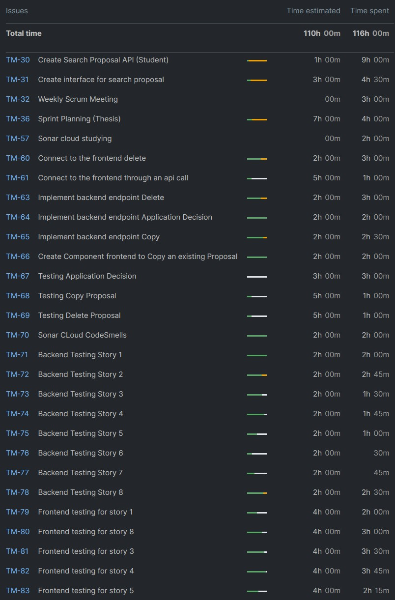

TEMPLATE FOR RETROSPECTIVE (Team 12)
=====================================

The retrospective should include _at least_ the following
sections:

- [process measures](#process-measures)
- [quality measures](#quality-measures)
- [general assessment](#assessment)

## PROCESS MEASURES 

### Macro statistics

- Number of stories committed vs. done
  6 out of 6
- Total points committed vs. done
  29 out of 29

- Nr of hours planned vs. spent (as a team)
  114 hours 45 minutes  out of hours 110 hours

**Remember**  a story is done ONLY if it fits the Definition of Done:
 
- Unit Tests passing
- Code review completed
- Code present on VCS
- End-to-End tests performed

> Please refine your DoD 

### Detailed statistics

| Story | # Tasks  | Points | Hours est. | Hours actual |
|-------|----------|--------|------------|--------------|
| #2    | 3        |  8     |     4 hours|   1 week  1 days 4 hour 30 minutes |
| #9    | 2        |  5     |     5 hours|   2 hours    |
| #10   | 3        |  3     |   1 day  1 hours |      7 hours |
| #11   | 4        | 5      |   1 day 6 hours |        6 hours  30 minutes|
| #14   | 1        | 5      |     2 hours |    2 hours|
| #15   | 1        | 3      | 2 hours    | 2 hours |
   

> place technical tasks corresponding to story `#0` and leave out story points (not applicable in this case)

- Hours per task (average, standard deviation)
- Total task estimation error ratio: sum of total hours estimation / sum of total hours spent -1

  
## QUALITY MEASURES 

- Unit Testing:
    - Total hours estimated
      16 hours

    - Total hours spent
      12 hours 45 minutes

    - Nr of automated unit test cases
      85

    - Coverage (if available)
      80%

- E2E testing:
    - Total hours estimated
      28 hours

    - Total hours spent
      27 hours

- Code review
    - Total hours estimated 1 hr
    - Total hours spent 1 hr
- Technical Debt management:
  - Total hours estimated 3 hr
  - Total hours spent 3 hr
  - Hours estimated for remediation by SonarQube 2hr
  - Hours estimated for remediation by SonarQube only for the selected and planned issues 1hr
  - Hours spent on remediation 2 hr
  - debt ratio (as reported by SonarQube under "Measures-Maintainability") 0.6%
  - rating for each quality characteristic reported in SonarQube under "Measures" (namely reliability, security, maintainability ) 0 bugs, 0 Vulnerabilities, 38 code smells
  

## ASSESSMENT

- What caused your errors in estimation (if any)? 
  - tasks about frontend testing needed more time so we lost most of out time implementing testing ⇒ Errors due to the okta authentication

- What lessons did you learn (both positive and negative) in this sprint? 
  - Positive:
    - Learning about cypress suite for frontend testing 
    - We (almost) got to 80 percent test coverage (from 10 percent last sprint)
    - We completed six stories (improvement from last sprint)
    
  - Negative:
    - Assigning too much time to tasks that don’t improve the impact of committed stories

- Which improvement goals set in the previous retrospective were you able to achieve? 
  - Improved test coverage at nearly 80 percent (huge increase)
  - Prioritizing the importance of stories and committing the most valuable ones 
  - Code review sessions

- Which ones were you not able to achieve? Why?

- Improvement goals for the next sprint and how to achieve them (technical tasks, team coordination, etc.)
  - Keep the code smells at a minimum 
  - Achieve story completion until user story 20

- One thing you are proud of as a Team!!
  - Distribution of work and communication in the team was great
